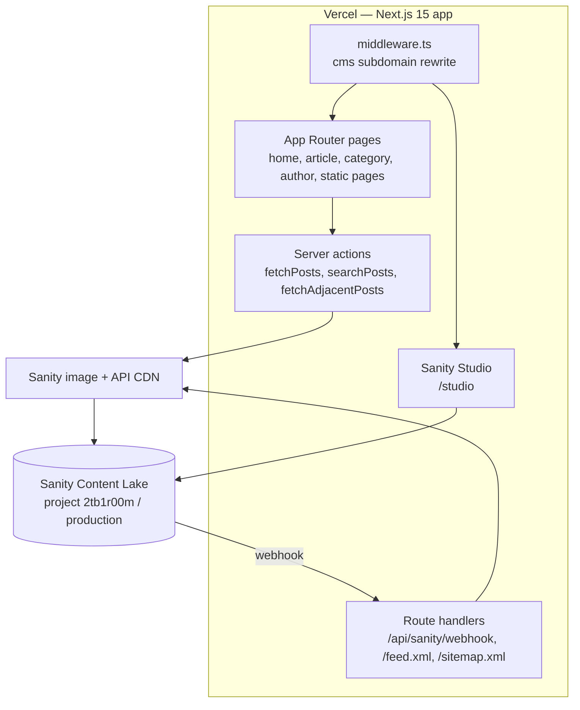

# 6Pistons Media — Publication Website (upstream)

**Automotive reviews publication with a built-in CMS, engineered for Google and AI-search visibility.**

      

**6pistons-Media** is the original codebase for [6Pistons Media](https://www.6pistons.com), an independent automotive
publication ("Brand Led by Enthusiasts"), created by Yash in December 2024 and maintained with Hirav Kadikar. It is a
Next.js 15 App Router site that reads articles, authors and categories from the **Sanity** headless CMS and renders fast,
SEO-rich review pages. The same deployment also hosts **Sanity Studio**, the editors' writing tool, at `/studio` and on
the `cms.6pistons.com` subdomain.

Beyond a normal blog, the site is engineered for discoverability: per-article Schema.org structured data (Article,
Review with a 1–10 score, FAQPage, VideoObject, BreadcrumbList), a dynamic XML sitemap, an RSS 2.0 feed, an `llms.txt`
guide for AI assistants, explicit crawler rules for search and AI bots, and instant re-indexing through IndexNow
whenever an editor publishes.

**Live:** https://www.6pistons.com  (editors: https://cms.6pistons.com)

## Table of contents

1. [At a glance](#at-a-glance)
2. [Key features](#key-features)
3. [Tech stack](#tech-stack)
4. [Architecture in one picture](#architecture-in-one-picture)
5. [Repository structure](#repository-structure)
6. [Getting started](#getting-started)
7. [Configuration](#configuration)
8. [Available scripts](#available-scripts)
9. [Testing](#testing)
10. [Deployment](#deployment)
11. [Documentation](#documentation)
12. [Project status](#project-status)
13. [Contributing](#contributing)
14. [Security](#security)
15. [Licence](#licence)
16. [Contacts](#contacts)

## At a glance

|  |  |
|---|---|
| What it is | The public website and editorial CMS for 6Pistons Media, an independent car, motorcycle and aviation review publication. |
| Who it is for | Readers looking for vehicle reviews; the 6Pistons editorial team who publish them; search engines and AI assistants that index them. |
| Status | Active — upstream source of the production site |
| Primary language | TypeScript |
| Hosting | Vercel project `6pistons-website` (deployed by GitHub Actions on push to master/main); Cloudflare DNS; Sanity Content Lake |
| Repository | Public — `yashd-dev/6pistons-Media` |
| Default branch | `master` |
| Commits / first / latest | 41 commits · 2024-12-03 → 2026-09-08 |
| Contributors | Yash (27), Hirav K (12), hiravk (2) |
| Upstream | Original repository by Yash (yashd-dev). A private continuation with later fixes lives at HiravK/6pm. |

## Key features

- **Review pages** — Hero image, verdict box (score out of 10, pros, cons), rich body, YouTube review embed, FAQs, reading time, author byline, related and previous/next articles
- **Embedded CMS** — Sanity Studio at /studio and cms.6pistons.com so editors publish without developers
- **Instant publishing** — Signed Sanity webhook revalidates pages and pings IndexNow within seconds of Publish
- **Search and browsing** — Keyword search across titles, descriptions and body text; category filters; pagination and infinite scroll
- **SEO and AI-search optimisation** — JSON-LD (Article, Review, FAQPage, VideoObject, BreadcrumbList, CollectionPage, ProfilePage), sitemap.xml, feed.xml, llms.txt, AI-crawler-friendly robots.txt
- **Trust pages** — About, Editorial Guidelines, Contact (press, pitch, advertising channels), Privacy and Terms
- **Responsive dark design** — Magazine layout tuned for phones, tablets, laptops and 4K displays
- **Analytics** — Umami (cookieless) and Ahrefs Web Analytics

## Tech stack

| Layer | Technology | Why it is used |
|---|---|---|
| Framework | Next.js 15.0.7 (App Router, Turbopack dev) | SSR/ISR pages, route handlers, server actions |
| UI | React 18.3 + Tailwind CSS 3.4 + @tailwindcss/typography | Styling and article typography |
| Motion | Framer Motion 11, Lenis | Animations and smooth scrolling |
| CMS | Sanity v3 + next-sanity 9 (Studio, Vision) | Headless content + embedded editor |
| Rich text | @portabletext/react | Render Sanity block content |
| Icons | lucide-react | UI icons |
| Language | TypeScript 5 | Type safety |
| Hosting / CI | Vercel + GitHub Actions (pnpm, Vercel CLI) | Build and production deploys |
| Analytics | Umami Cloud, Ahrefs Web Analytics | Privacy-friendly traffic stats |

## Architecture in one picture



Full detail: [docs/ARCHITECTURE.md](docs/ARCHITECTURE.md).

## Repository structure

```text
6pm/
├── .github/workflows/main.yml   # Vercel production deploy
├── public/                      # robots.txt, llms.txt, IndexNow key, logos, OG image
├── sanity.config.ts             # Studio configuration
├── sanity.cli.ts                # Sanity CLI (studioHost: sixpistons)
├── next.config.ts               # images, redirects, security headers
└── src/
    ├── middleware.ts            # cms subdomain routing
    ├── lib/slugs.ts             # slug + YouTube helpers
    ├── sanity/                  # env, client, image, live, queries, schemaTypes, structure
    └── app/
        ├── page.tsx             # home (paginated list)
        ├── article/[slug]/      # review pages
        ├── category/[category]/ # category listings
        ├── author/[slug]/       # author profiles
        ├── actions/             # server actions (GROQ)
        ├── api/sanity/webhook/  # revalidate + IndexNow
        ├── feed.xml/ sitemap.ts # discovery feeds
        ├── studio/[[...tool]]/  # embedded Sanity Studio
        ├── components/          # navbar, footer, search, etc.
        └── about|contact|editorial-guidelines|privacy|terms/
```

## Getting started

### Prerequisites

- Node.js 18+ (CI uses 18; 20 LTS recommended)
- npm or pnpm
- Access to Sanity project `2tb1r00m` (for Studio editing)

### Install and run locally

```bash
git clone https://github.com/HiravK/6pm.git
cd 6pm
cp .env.example .env.local      # fill in tokens/secrets if you need the webhook
npm install
npm run dev                     # http://localhost:3000  (Studio: /studio)
```

## Configuration

Copy the example file and fill in real values. **Never commit real secrets.**

| Variable | Required | Purpose | Example / default |
|---|---|---|---|
| `NEXT_PUBLIC_SANITY_PROJECT_ID` | No (defaults to 2tb1r00m) | Sanity project ID | `2tb1r00m` |
| `NEXT_PUBLIC_SANITY_DATASET` | No (defaults to production) | Sanity dataset | `production` |
| `NEXT_PUBLIC_SANITY_API_VERSION` | No | GROQ API version date | `2024-12-04` |
| `SANITY_STUDIO_BASE_PATH` | No | Studio base path during server render | `/studio` |
| `SANITY_API_READ_TOKEN` | No | Token for draft/live reads (not used by public pages today) |  |
| `SANITY_API_WRITE_TOKEN` | No | Reserved for scripts that write content |  |
| `SANITY_WEBHOOK_SECRET` | Yes (production) | Secret used to verify Sanity webhook signatures |  |
| `NEXT_PUBLIC_SANITY_HOOK_SECRET` | No | Legacy fallback for the webhook secret — do not use (NEXT_PUBLIC_ values are exposed to browsers) |  |
| `NEXT_PUBLIC_SITE_URL` | No | Site base URL | `http://localhost:3000` |
| `NEXT_PUBLIC_FACEBOOK_APP_ID` | No | Adds fb:app_id meta tag when set |  |

## Available scripts

| Command | What it does |
|---|---|
| `npm run dev` | Start dev server with Turbopack on :3000 |
| `npm run build` | Production build |
| `npm start` | Serve the production build |
| `npm run lint` | ESLint (next/core-web-vitals) |

## Testing

No automated test suite exists yet. Quality is checked by `npm run lint`, a successful `next build`, and the manual smoke tests below. See [docs/PROJECT.md](docs/PROJECT.md#quality-and-testing).

## Deployment

Every push to `main` (or `master`) runs the GitHub Actions workflow, which builds with the Vercel CLI and deploys to production. It can also be triggered manually (workflow_dispatch). Step-by-step: [docs/RUNBOOK.md](docs/RUNBOOK.md).

## Documentation

Every document below is part of the project's controlled documentation set.

| Document | Audience | What it answers |
|---|---|---|
| [README](README.md) | Everyone | What is it, how do I run it, where is everything? |
| [Project Overview (in depth)](docs/PROJECT.md) | Everyone | Why it exists, every feature explained, timeline, quality, security, risks, glossary |
| [Product Requirements (PRD)](docs/PRD.md) | Product, business, engineering | What problem, for whom, what must it do, how is success measured? |
| [Architecture](docs/ARCHITECTURE.md) | Engineers, architects | How is it built, how does data flow, where does it run, why? |
| [Runbook](docs/RUNBOOK.md) | Engineers, operators | How do I set it up, configure, deploy, roll back and troubleshoot it? |
| [Session Handover](docs/SESSION_HANDOVER.md) | Next owner / next session | Where exactly did work stop and what is next? |

## Project status

This is the original, public repository for the 6Pistons Media website (default branch `master`). It contains the full
September 2026 technical-SEO / AI-GEO / responsive overhaul and the restored Sanity Studio (commits up to 2026-09-08).
A private continuation, **HiravK/6pm**, carries ten further fixes made on 2026-09-08 → 2026-09-24 (webhook secret
fallback, Studio dynamic rendering, CMS chrome hiding, cms-root redirect, social-bot rules + fb:app_id, image
optimisation disabled to stop Vercel 402 errors, mobile background fix, legacy sitemap redirects, breadcrumb fix).
Decide which repository is the single source of truth and port the missing commits so the two do not drift.
`agent.md` in the repository root is a detailed infrastructure handbook (Cloudflare, Vercel, Sanity, GTM) and remains valid.

Latest hand-off notes: [docs/SESSION_HANDOVER.md](docs/SESSION_HANDOVER.md).

## Contributing

Branch from the default branch (`feat/…`, `fix/…`), use Conventional Commit messages, open a pull request, and update the docs in the same PR.

## Security

Please do not open public issues for vulnerabilities; contact the maintainer privately. Security design is covered in [docs/PROJECT.md](docs/PROJECT.md#security-and-privacy).

## Licence

No licence file is present, so all rights are reserved by the owner by default. Add a `LICENSE` file before accepting outside contributions or reuse.

## Contacts

| Role | Name | Contact |
|---|---|---|
| Repository owner | Yash | [@yashd-dev](https://github.com/yashd-dev) |
| Maintainer (2025–2026) | Hirav Kadikar | [@HiravK](https://github.com/HiravK) |
