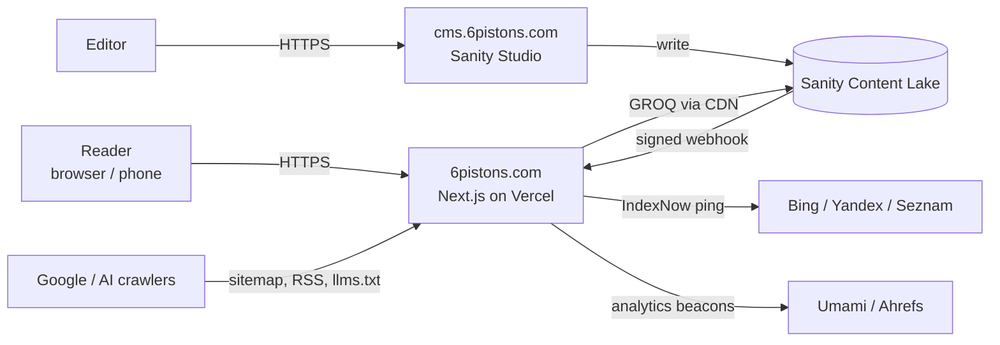
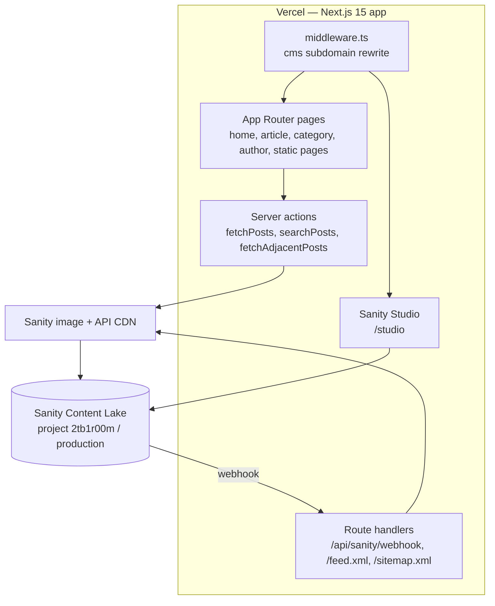
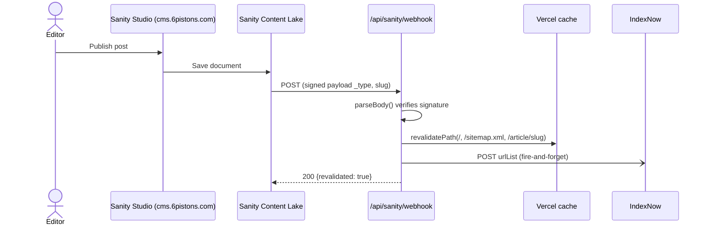
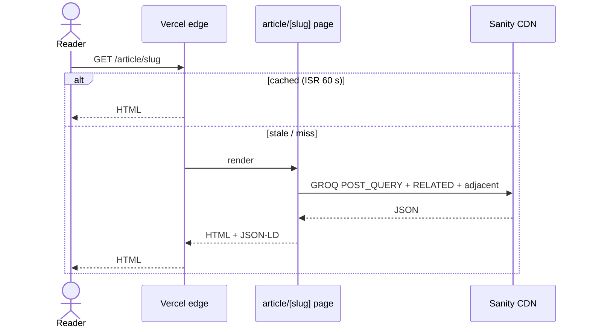
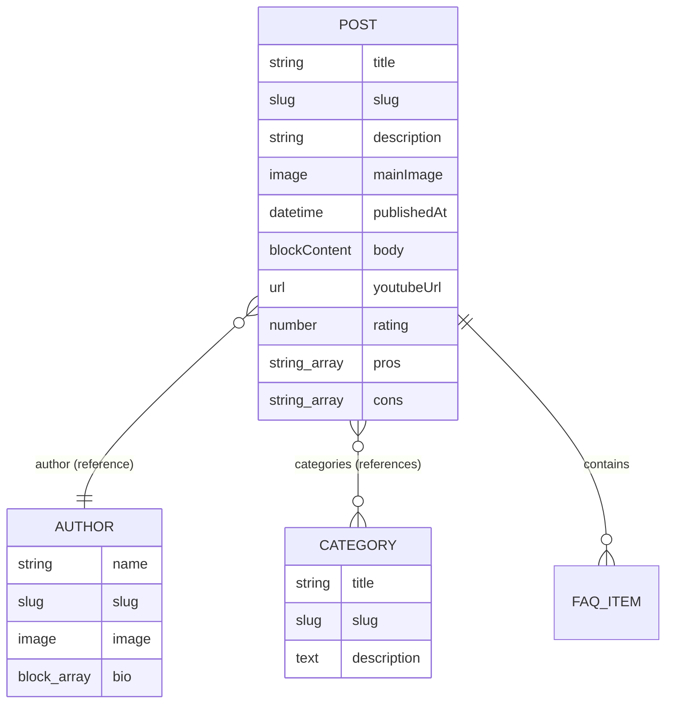

# Architecture Document — 6Pistons Media — Publication Website (upstream)

| Field | Value |
|---|---|
| Document ID | 6PMU-ARCH |
| Project | 6Pistons Media — Publication Website (upstream) |
| Repository | [`yashd-dev/6pistons-Media`](https://github.com/yashd-dev/6pistons-Media) |
| Version | 1.0 |
| Status | Approved — living document |
| Owner | Hirav Kadikar |
| Classification | Public |
| Last updated | 2026-09-25 |

> **Purpose:** Explains how the system is built: its parts, how data moves, where it runs, and why it was built this way. Structured on the C4 model and arc42.

## 1. Revision history

| Version | Date | Author | Change |
|---|---|---|---|
| 1.0 | 2026-09-25 | Hirav Kadikar | Full documentation suite generated from a complete review of the repository. |

## 2. Introduction and goals

A single Next.js 15 (App Router) application deployed to Vercel serves two audiences from one codebase:
**readers** (public site, server-rendered React with incremental static regeneration) and **editors** (Sanity Studio
mounted at `/studio`, or at the root of `cms.6pistons.com` via middleware rewrite). All content is stored in the Sanity
Content Lake and read through the Sanity CDN with GROQ queries from server components and server actions. When an
editor publishes, a signed Sanity webhook tells the site to revalidate cached pages and pings IndexNow.

### Quality goals (in priority order)

| Priority | Quality attribute | What it means here |
|---|---|---|
| 1 | Discoverability (SEO / AI-GEO) | Correct canonicals, structured data, sitemap, RSS, llms.txt, crawler rules |
| 2 | Editor autonomy | Non-technical editors publish without developer help |
| 3 | Performance | Edge-cached pages and CDN-served content |
| 4 | Cost efficiency | Stay within free tiers |

## 3. Constraints

- Free / hobby tiers of Vercel and Sanity; Vercel image optimisation disabled because of quota errors.
- Studio and site ship in the same Next.js deployment.

## 4. System context (C4 level 1)

Who and what the system talks to.

| External actor / system | Interaction |
|---|---|
| Sanity Content Lake + CDN | Stores and serves all articles, authors, categories, images |
| Vercel | Hosting, edge cache, serverless functions |
| GitHub Actions | Builds and deploys on push to main/master |
| IndexNow API | Instant re-indexing on Bing/Yandex/Seznam |
| Umami Cloud & Ahrefs Analytics | Visitor analytics |
| YouTube (nocookie embeds) | Video reviews |
| Google Calendar booking link | /bookings redirect |

## 5. Containers (C4 level 2)

## 6. Components (C4 level 3)

| Component | Location | Responsibility |
|---|---|---|
| Middleware | `src/middleware.ts` | Detects `cms.` host or `/studio`, sets `x-is-cms`, redirects cms root to `/structure/post`, rewrites cms paths to `/studio/*` |
| Root layout | `src/app/layout.tsx` | Fonts, global metadata, Organization/WebSite JSON-LD, analytics scripts, hides navbar/footer on CMS pages |
| Home page | `src/app/page.tsx` | Paginated + category-filtered post list (AllBlogs component) |
| Article page | `src/app/article/[slug]/page.tsx` | Article render, metadata, Article/Review/FAQ/Video/Breadcrumb JSON-LD, related posts, prev/next |
| Category page | `src/app/category/[category]/page.tsx` | Category listing with CollectionPage + BreadcrumbList schema |
| Author page | `src/app/author/[slug]/page.tsx` | Author profile with ProfilePage/Person schema |
| Static pages | `src/app/{about,contact,editorial-guidelines,privacy,terms}` | Trust / E-E-A-T and legal pages |
| Server actions | `src/app/actions/` | GROQ data access: pagination, categories, search, adjacent/more posts |
| Webhook handler | `src/app/api/sanity/webhook/route.ts` | Verifies Sanity signature, revalidates paths, pings IndexNow |
| Sitemap / RSS | `src/app/sitemap.ts, src/app/feed.xml/route.ts` | Machine-readable discovery feeds |
| Sanity config & schemas | `sanity.config.ts, src/sanity/` | Studio config, content model, client, image URL builder |
| UI components | `src/app/components/` | Navbar, footer, search dialog, infinite scroll, YouTube embed, post navigation, hero |
| Slug helpers | `src/lib/slugs.ts` | Accent-insensitive category slugs; YouTube ID extraction |

## 7. Runtime view — key flows

### Editor publishes an article

### Reader opens an article

## 8. Data architecture

All persistent data lives in Sanity (project `2tb1r00m`, dataset `production`). The website is read-only against Sanity
(public CDN, no token needed); Studio writes as the logged-in Sanity user. There is no application database. Images are
stored as Sanity assets and served from `cdn.sanity.io` with `auto=format`.

### Entity: post

A review or article.

| Field | Type | Description |
|---|---|---|
| `title` | string | Headline |
| `slug` | slug (from title) | URL segment used at /article/<slug> |
| `description` | string | Meta description and card summary |
| `author` | reference → author | Byline |
| `mainImage` | image (+ alt) | Hero and Open Graph image |
| `categories` | array<reference → category> | Taxonomy; first category used in breadcrumbs/RSS |
| `publishedAt` | datetime | Ordering and prev/next navigation |
| `body` | blockContent | Rich text: H1–H4, quote, lists, bold/italic, links, images with alt |
| `youtubeUrl` | url | Optional video review |
| `rating` | number 1–10 | Optional review score → Review schema |
| `pros / cons` | array<string> | Verdict box |
| `faqs` | array<{question, answer}> | FAQ block + FAQPage schema |

### Entity: author

| Field | Type | Description |
|---|---|---|
| `name` | string | Display name |
| `slug` | slug | /author/<slug> |
| `image` | image | Avatar |
| `bio` | array<block> | Short biography |

### Entity: category

| Field | Type | Description |
|---|---|---|
| `title` | string | Name (e.g. Cars, Bikes, Aviation) |
| `slug` | slug | Stored slug (site derives its own) |
| `description` | text | Category blurb |

## 9. Deployment view

Every push to `main` (or `master`) runs the GitHub Actions workflow, which builds with the Vercel CLI and deploys to production. It can also be triggered manually (workflow_dispatch).

| Environment | Where | Notes |
|---|---|---|
| Local | http://localhost:3000 (`npm run dev`) | Studio at /studio uses the same Sanity project |
| Production | Vercel project `6pistons-website` → www.6pistons.com | 6pistons.com redirects (308) to www. DNS and registrar: Cloudflare (nameservers harley/ximena.ns.cloudflare.com) |
| Hosted Studio (optional) | https://6pistons.sanity.studio via `sanity deploy` | cms.6pistons.com can proxy/redirect here instead of the embedded Studio |

## 10. Technology stack

| Layer | Technology | Why |
|---|---|---|
| Framework | Next.js 15.0.7 (App Router, Turbopack dev) | SSR/ISR pages, route handlers, server actions |
| UI | React 18.3 + Tailwind CSS 3.4 + @tailwindcss/typography | Styling and article typography |
| Motion | Framer Motion 11, Lenis | Animations and smooth scrolling |
| CMS | Sanity v3 + next-sanity 9 (Studio, Vision) | Headless content + embedded editor |
| Rich text | @portabletext/react | Render Sanity block content |
| Icons | lucide-react | UI icons |
| Language | TypeScript 5 | Type safety |
| Hosting / CI | Vercel + GitHub Actions (pnpm, Vercel CLI) | Build and production deploys |
| Analytics | Umami Cloud, Ahrefs Web Analytics | Privacy-friendly traffic stats |

## 11. Cross-cutting concepts

### SEO and AI-GEO

Canonical URL per page, `metadataBase` https://www.6pistons.com, Open Graph + Twitter cards, JSON-LD graphs, `X-Robots-Tag` header, sitemap, RSS (`<link rel=alternate>`), `llms.txt`, AI-friendly robots rules, IndexNow key file in `public/`.

### Caching

ISR windows: article 60 s, home 300 s, sitemap/feed 3600 s, plus on-demand revalidation from the webhook. Note: the root layout exports `dynamic = 'force-dynamic'`, which overrides static caching for all pages.

### CMS isolation

Middleware sets `x-is-cms`; the layout hides navbar, footer and noise overlay so Studio gets the full viewport.

### Configuration safety

`src/sanity/env.ts` sanitises project ID and dataset (falls back to `2tb1r00m`/`production` if Vercel injects `[SENSITIVE]` or invalid values).

### Security headers

X-Content-Type-Options nosniff, X-Frame-Options DENY, X-XSS-Protection, Referrer-Policy strict-origin-when-cross-origin on all routes.

## 12. Architecture decisions (ADR log)

### ADR-01: Use Sanity as a headless CMS embedded in the Next.js app

|  |  |
|---|---|
| Status | Accepted |
| Date | 2024-12-04 |
| Context | Editors need a friendly rich-text editor; the team wanted no separate CMS server to host. |
| Decision | Use Sanity v3 (hosted Content Lake) and mount Sanity Studio inside the Next.js app at `/studio`. |
| Consequences | One deployment for site + CMS; Free tier covers current volume; Studio bundle increases build size |
| Alternatives considered | WordPress (hosting + security burden); Markdown in Git (not editor-friendly); Contentful (paid tiers) |

### ADR-02: Deploy to Vercel via GitHub Actions and the Vercel CLI

|  |  |
|---|---|
| Status | Accepted |
| Date | 2024-12-05 |
| Context | Needed reproducible production deploys from the repo. |
| Decision | `.github/workflows/main.yml` runs `vercel pull/build/deploy --prebuilt --prod` on push to main/master and on manual dispatch. |
| Consequences | Requires VERCEL_TOKEN / ORG_ID / PROJECT_ID secrets; Build happens in GitHub not Vercel |
| Alternatives considered | — |

### ADR-03: Serve the CMS on a cms subdomain through middleware rewrites

|  |  |
|---|---|
| Status | Accepted |
| Date | 2026-09-08 |
| Context | Editors wanted a memorable URL, and Studio should not show the public navbar/footer. |
| Decision | Middleware rewrites `cms.6pistons.com/*` to `/studio/*` and redirects its root to `/structure/post`; the layout hides site chrome when `x-is-cms` is set. |
| Consequences | Adaptive Studio basePath logic in sanity.config.ts; DNS for cms subdomain must point to Vercel |
| Alternatives considered | — |

### ADR-04: Invest in AI-search discoverability (llms.txt, RSS, structured data, AI crawler allow-list)

|  |  |
|---|---|
| Status | Accepted |
| Date | 2026-09-08 |
| Context | A growing share of discovery comes from AI assistants, which cite sites with clear machine-readable signals. |
| Decision | Add `llms.txt`, `/feed.xml`, rich JSON-LD graphs and a robots.txt that explicitly allows GPTBot, PerplexityBot, ClaudeBot etc. |
| Consequences | Content may be used by AI models; Better citation and referral potential |
| Alternatives considered | — |

### ADR-05: Instant indexing through IndexNow on publish

|  |  |
|---|---|
| Status | Accepted |
| Date | 2026-09-08 |
| Context | Bing/DuckDuckGo discovery lagged by days. |
| Decision | Webhook pings IndexNow with the changed URLs (best effort, never blocks the webhook). |
| Consequences | Key file must stay in `public/`; Google does not use IndexNow |
| Alternatives considered | — |

## 13. Quality scenarios

| Scenario | Expected response |
|---|---|
| Editor publishes a new article | Visible on the home page and at its URL within 1 minute; IndexNow pinged |
| Sanity API is down | Cached pages keep serving; uncached pages error (improvement: add error boundary) |
| Traffic spike from social media | Vercel edge serves cached HTML; Sanity CDN absorbs reads |

## 14. Risks and technical debt

Full register in [PROJECT.md](PROJECT.md#risks-and-technical-debt). Top items:

- **Outdated Next.js with known CVEs** — Upgrade and add Dependabot
- **Home redirect loop if no posts are returned** — Replace redirect with empty state
- **Vercel/Sanity free-tier limits exceeded during traffic spikes** — Keep CDN reads, remove force-dynamic, monitor usage
- **No automated tests; regressions reach production** — Playwright smoke tests in CI
- **Category rename changes URLs and loses rankings** — Add redirects when renaming categories

## 15. Glossary

See [PROJECT.md](PROJECT.md#glossary).
